# Rigid Body Simulation

> Blender 骨骼物理辅助插件 · **v1.1.1**
>
> 在 Blender 姿态模式中，把骨骼链转换为可编辑的刚体模拟、添加骨骼碰撞体、创建连续或双孤岛 IK，以及为选定骨骼添加局部旋转传递。

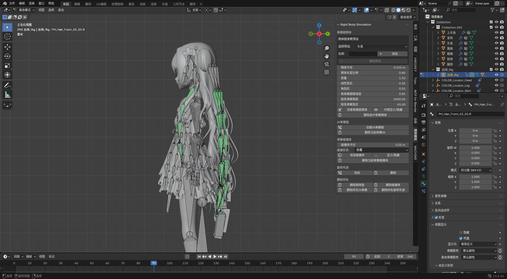

## 功能导航

- [安装与开始](#安装与开始)
- [一、刚体骨骼链](#一刚体骨骼链)
  - [头发预设](#头发预设)
  - [飘带预设](#飘带预设)
  - [裙摆预设](#裙摆预设)
- [二、骨骼碰撞体](#二骨骼碰撞体)
- [三、IK 绑定](#三ik-绑定)
- [四、旋转传递](#四旋转传递)
- [通用管理与清理](#通用管理与清理)
- [使用建议与限制](#使用建议与限制)

## 安装与开始

### 环境要求

- Blender **4.2 或更高版本**。
- 一个可编辑的 Armature（骨架）。
- 使用前切换到 **Pose Mode（姿态模式）**，在 3D 视图按 `N` 打开侧栏，再切换到 **刚体模拟** 标签。

### 安装方式

1. 下载 `RigidBodySimulation-<版本>-extension.zip`（Blender 4.x 推荐）或 `RigidBodySimulation-<版本>-addon.zip`。
2. 扩展包：打开 **编辑 > 偏好设置 > 扩展 > 从磁盘安装**。
3. Add-on 包：打开 **编辑 > 偏好设置 > 插件 > 安装...**。
4. 启用插件，选择骨架并进入姿态模式。

也可以从源码安装：将 `RigidBodySimulation` 文件夹复制到 Blender 用户目录的 `scripts/addons/` 下，然后在偏好设置中启用。不要再套一层同名文件夹。

## 一、刚体骨骼链

刚体骨骼链适合头发、飘带、裙摆、衣摆等需要保留根部动画、让末端产生物理摆动的结构。

### 基本流程

1. 在姿态模式选择一条**连续的父子骨骼链**。
2. 将链条根部设为活动骨骼。
3. 选择一个预设，或直接调整刚体半径、长度比例、质量、阻尼、根骨骼跟随强度和弹簧参数。
4. 点击 **创建骨骼链刚体**。
5. 播放时间轴或修改根骨骼姿态，观察刚体链的跟随与摆动。

根骨骼保持动画控制；其余选中的骨骼会生成刚体代理和链间约束。生成的代理位于 `RBS_Physics` 集合下，便于在 Outliner 中统一管理。

### 头发预设

头发通常骨骼数量较多、摆动幅度适中。建议从头发链根部开始选择，使用 **头发** 预设，再根据发束长度微调质量和弹簧阻尼。

<table>
<tr>
<td>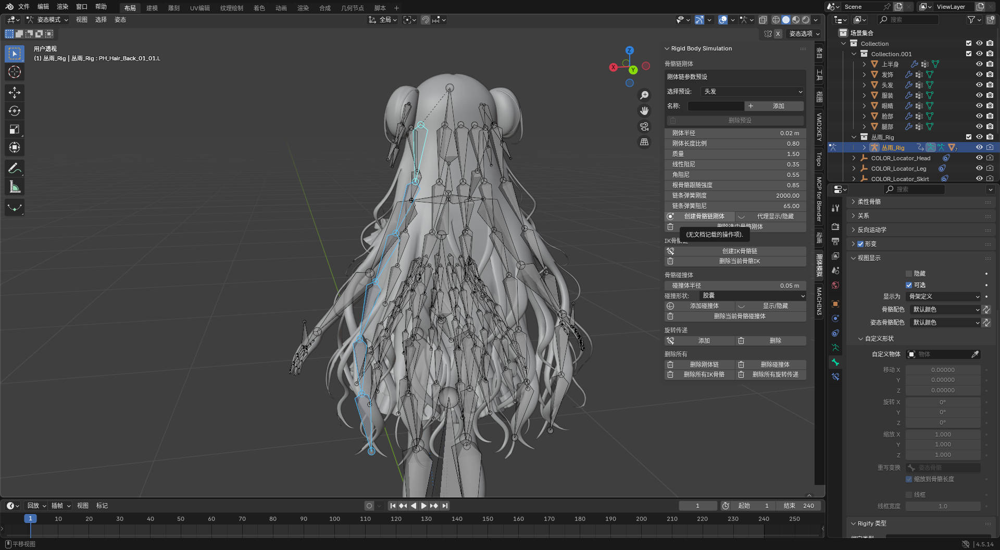 选择头发骨骼链</td>
<td>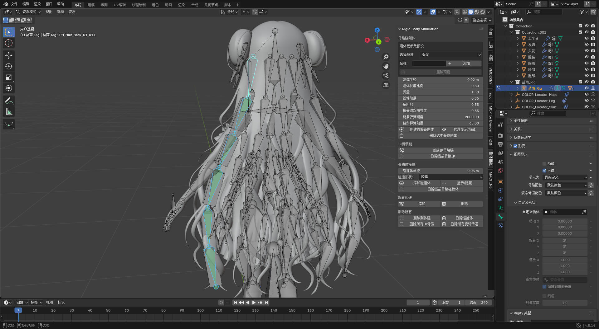 创建头发刚体链</td>
</tr>
<tr>
<td>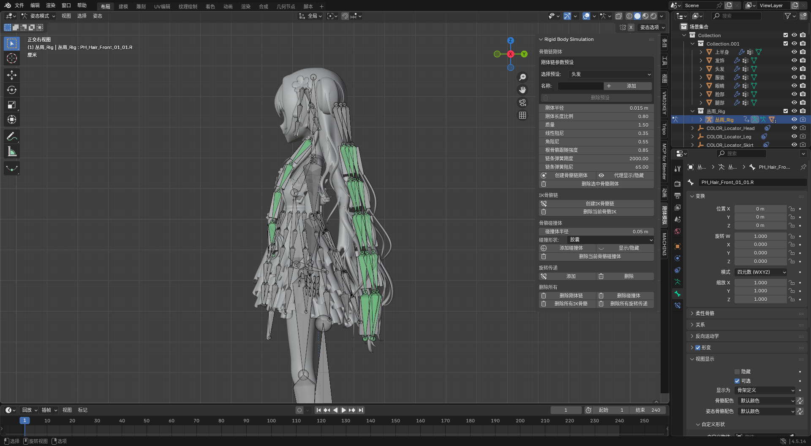 模拟前</td>
<td> 模拟后</td>
</tr>
</table>

### 飘带预设

飘带需要更明显的柔性和连续传递。选择飘带根部到末端的连续链条，使用 **飘带** 预设；如果出现高频抖动，优先增加弹簧阻尼或降低质量。

<table>
<tr>
<td>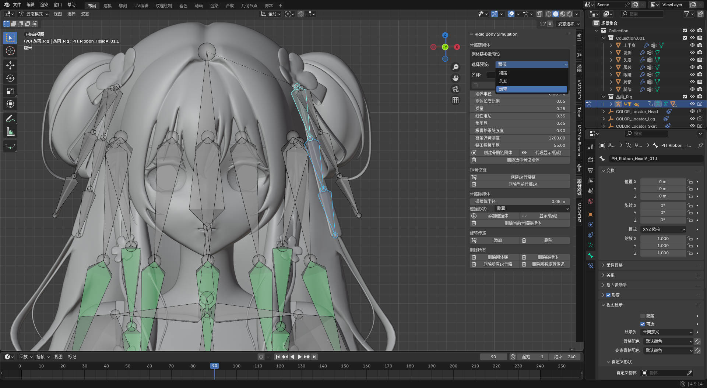 选择飘带骨骼链</td>
<td>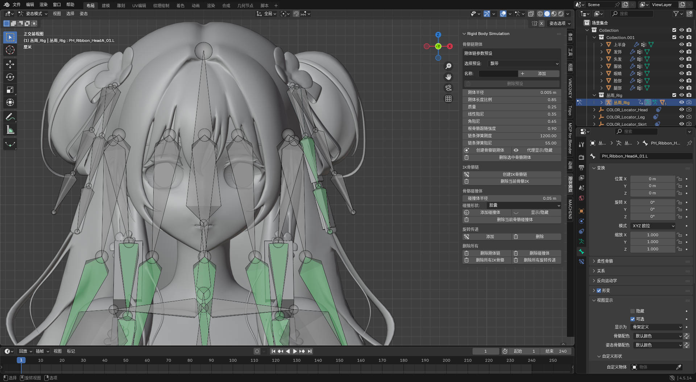 创建飘带刚体链</td>
</tr>
<tr>
<td>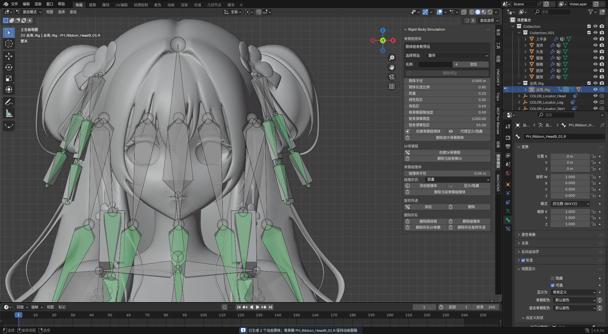 模拟前</td>
<td>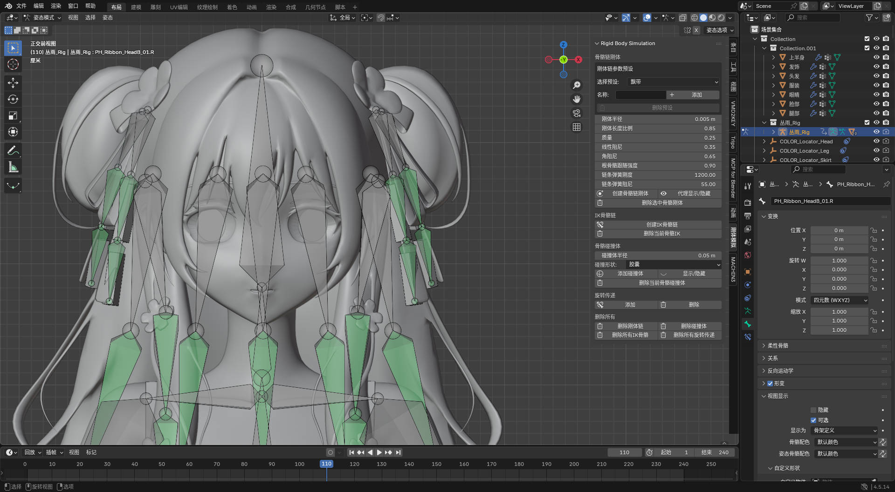 模拟后</td>
</tr>
</table>

### 裙摆预设

裙摆往往需要更稳定的整体跟随。选择裙摆骨骼链，使用 **裙摆** 预设；根骨骼跟随强度决定裙摆对角色动画的保持程度，弹簧刚度和阻尼决定边缘的回弹速度。

<table>
<tr>
<td>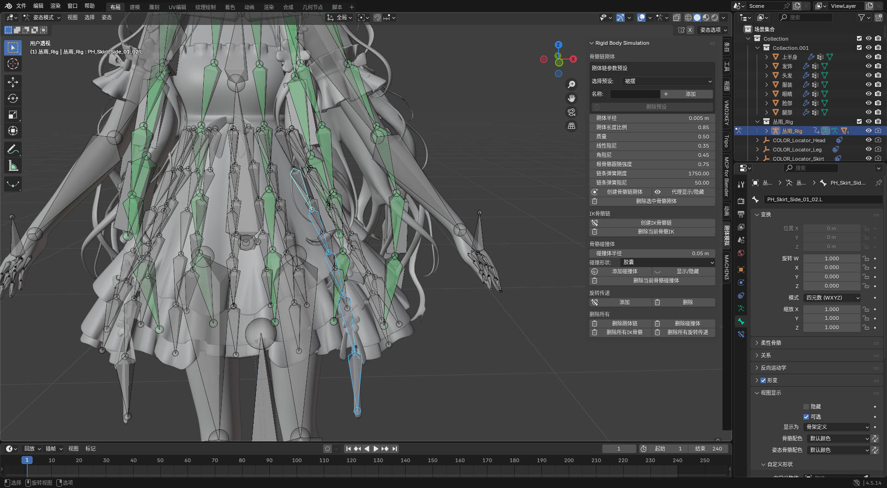 选择裙摆骨骼链</td>
<td>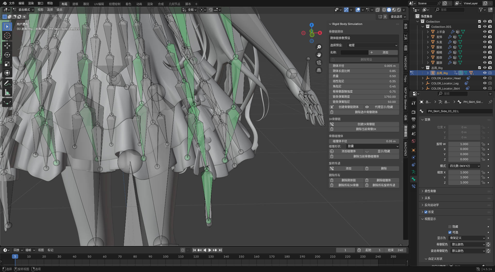 创建裙摆刚体链</td>
</tr>
<tr>
<td>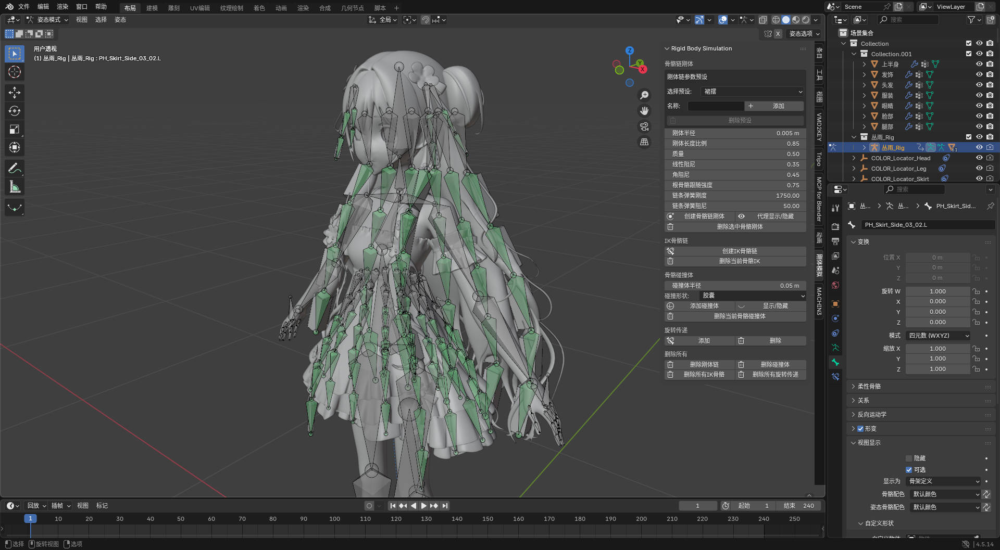 模拟前</td>
<td>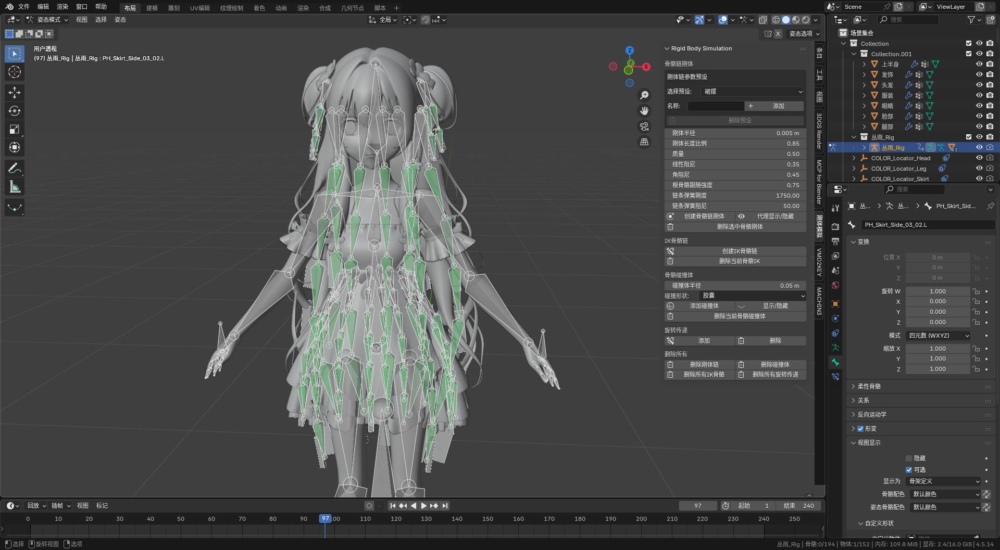 模拟后</td>
</tr>
</table>

### 刚体链参数

| 参数 | 作用 | 调整方向 |
| --- | --- | --- |
| 刚体半径 | 控制代理刚体的粗细 | 太容易穿插时适当增大 |
| 刚体长度比例 | 控制代理沿骨骼的覆盖长度 | 想减少重叠时适当降低 |
| 质量 | 控制刚体惯性 | 轻薄部件使用较小值 |
| 线性阻尼 / 角阻尼 | 抑制平移和旋转速度 | 抖动时提高阻尼 |
| 根骨骼跟随强度 | 控制链条跟随动画根部的程度 | 想更贴合角色时提高 |
| 链条弹簧刚度 / 阻尼 | 控制相邻刚体的回弹和稳定性 | 柔软效果降低刚度，稳定效果提高阻尼 |

插件提供 **裙摆、头发、飘带** 三个内置预设，也支持填写名称后保存自定义预设；自定义预设可在当前场景中重复使用。

内置预设的初始参数如下，创建后仍可继续微调：

| 预设 | 半径 | 长度比例 | 质量 | 根部跟随 | 弹簧刚度 | 弹簧阻尼 |
| --- | ---: | ---: | ---: | ---: | ---: | ---: |
| 头发 | 0.02 | 0.80 | 1.50 | 0.85 | 2000 | 65 |
| 飘带 | 0.005 | 0.85 | 0.25 | 0.90 | 1200 | 55 |
| 裙摆 | 0.01 | 0.85 | 0.50 | 0.75 | 1750 | 50 |

## 二、骨骼碰撞体

骨骼碰撞体用于阻挡刚体链，例如身体、腿部、手臂或其他不会参与物理摆动、但需要与头发和衣物发生碰撞的部位。

### 创建碰撞体

1. 选择需要充当障碍物的骨骼，可以一次选择多根。
2. 设置 **碰撞体半径**。
3. 选择碰撞形状：**盒体、胶囊、球体**。
4. 点击 **添加碰撞体**。该操作只为当前选中的骨骼创建碰撞体，重复创建会替换对应旧碰撞体。

<table>
<tr>
<td>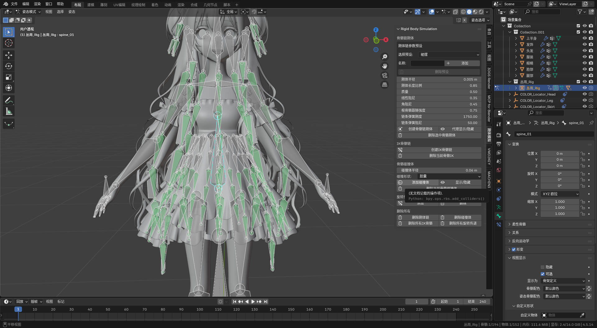 创建骨骼碰撞体</td>
<td>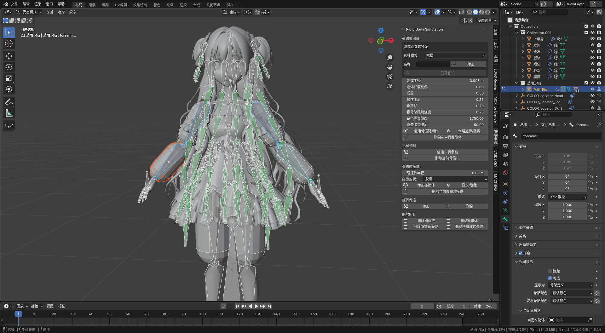 为选中骨骼批量创建</td>
<td>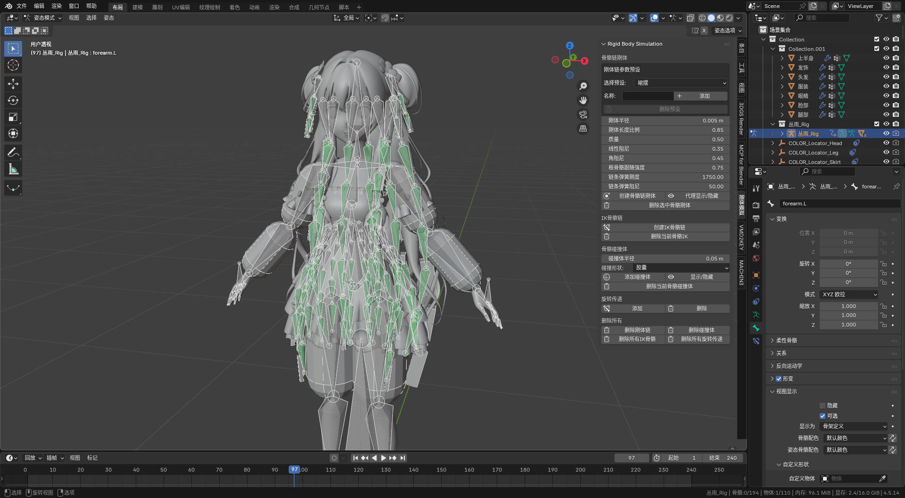 碰撞模拟效果</td>
</tr>
</table>

碰撞体会跟随普通骨骼姿态移动，也能与 IK 解算结果配合。**显示/隐藏碰撞体**只改变视图和渲染可见性，不会停用物理碰撞；需要完全移除时使用 **删除当前骨骼碰撞体** 或 **删除所有 > 删除碰撞体**。

## 三、IK 绑定

IK 模块会创建 Blender 原生 IK 约束和一个可移动的自定义控制物体。控制骨只负责平移，旋转和缩放通道默认锁定，适合直接拖动控制末端。

### 连续骨骼链模式

1. 选择连续骨骼链，并将链条末端设为活动骨骼。
2. 点击 **创建 IK 骨骼链**。
3. 插件会在活动骨骼末端生成 IK 控制骨，并把 IK 约束添加到链条末端。

### 双孤岛模式：不相连的 IK 骨骼与目标链

双孤岛模式适合已有独立 IK 控制骨的角色绑定：

1. 选择一个独立的 IK 骨骼作为活动项。
2. 同时选择另一组需要被解算的连续骨骼链。
3. 活动项所在孤岛必须**只有一根骨骼**。
4. 另一孤岛必须是**连续、无分支的单链**。
5. 点击 **创建 IK 骨骼链**。

此时不会额外生成 IK 控制骨；活动项直接作为 IK 目标，另一孤岛最末端骨骼接收 IK 约束，链条长度等于该孤岛的骨骼数量。超过两个孤岛、活动孤岛包含多根骨骼或目标孤岛出现分支时，操作会被拒绝。

<table>
<tr>
<td>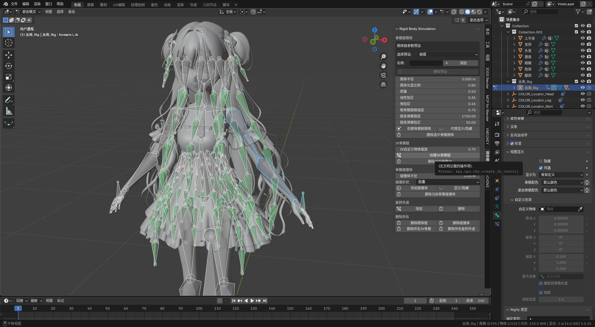 手臂：选择双孤岛</td>
<td>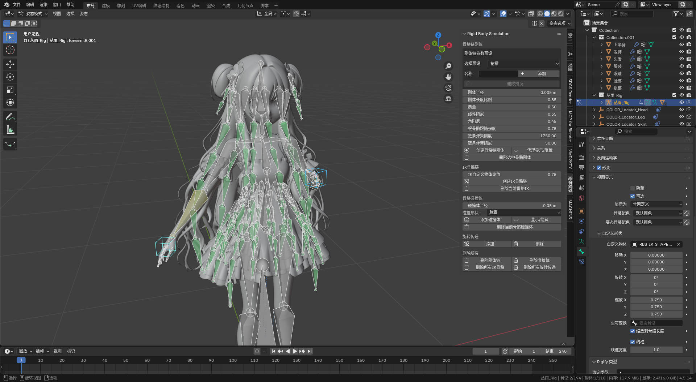 手臂：创建 IK</td>
</tr>
<tr>
<td>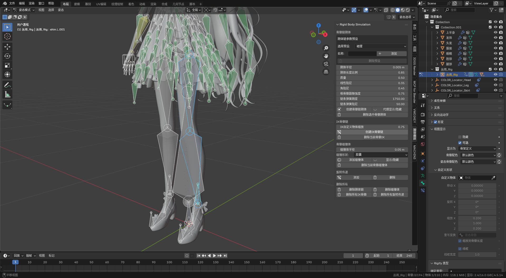 脚部：选择双孤岛</td>
<td>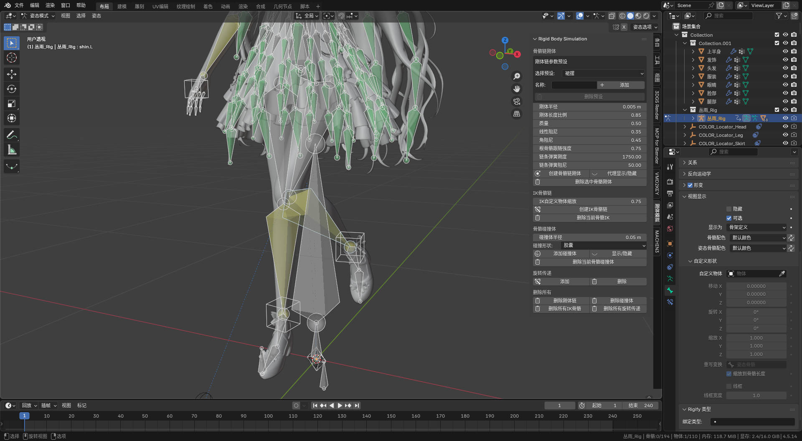 脚部：创建 IK</td>
</tr>
</table>

### IK 自定义物体缩放

面板中的 **IK 自定义物体缩放** 是一个统一数值，默认值为 `0.75`。创建 IK 时该数值会同时写入自定义物体的 X、Y、Z 三个缩放轴，保证控制物体不会被拉成长条。自定义物体的移动偏移和 IK 骨骼姿态位移会归零，便于在变换面板中直接管理。

## 四、旋转传递

旋转传递适合手指、指节或需要继承父骨骼局部 X 轴旋转的辅助链。

### 添加旋转传递

1. 选择一根骨骼，或选择一条连续骨骼链。
2. 设置需要作为起点的骨骼为活动项。
3. 点击 **添加**。

插件会为链条中的后续骨骼创建 `Copy Rotation` 约束，只传递父骨骼的局部 X 轴旋转，不覆盖其他手动创建的旋转约束。重新添加会替换本插件此前生成的同类约束。

<table>
<tr>
<td>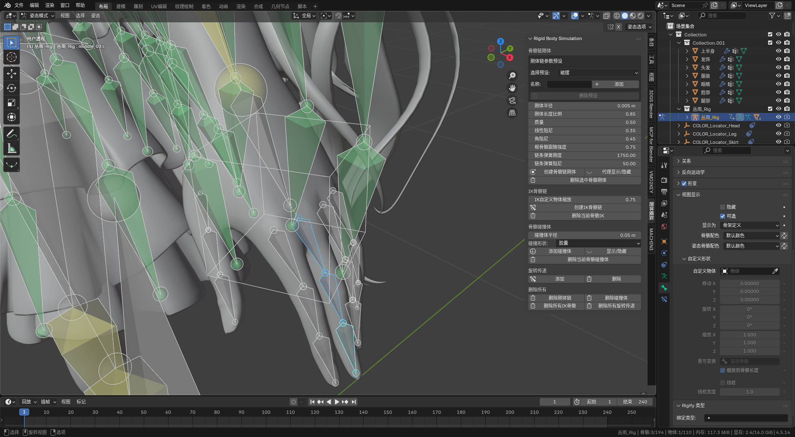 选择手指骨骼链</td>
<td>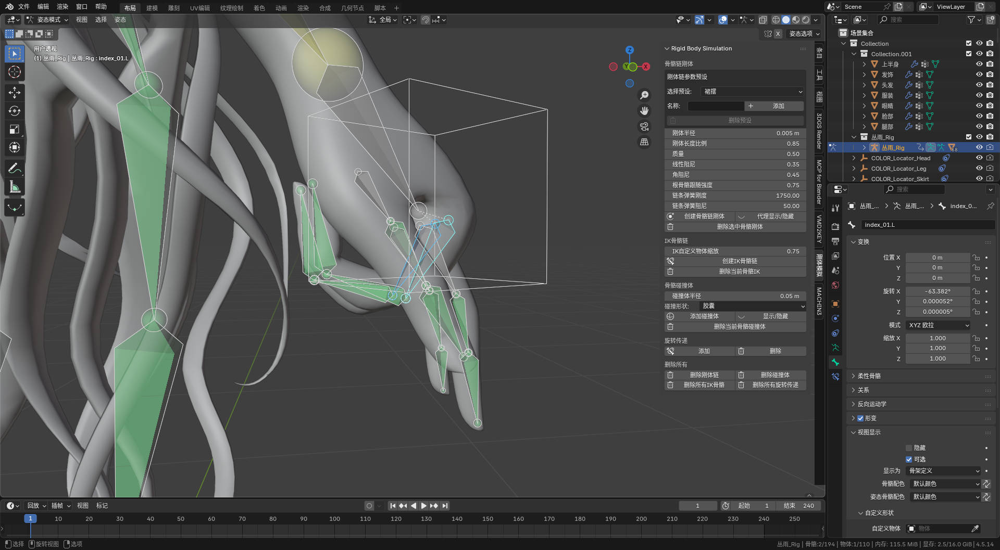 创建与使用效果</td>
</tr>
</table>

使用 **删除** 可移除当前选中骨骼上的旋转传递，使用 **删除所有旋转传递** 可清除当前骨架上由本插件创建的全部旋转传递约束。

## 通用管理与清理

- **显示/隐藏刚体代理**：隐藏刚体代理的视图显示，物理模拟仍然运行。
- **显示/隐藏碰撞体**：隐藏碰撞体代理的视图显示，碰撞仍然生效。
- **删除选中骨骼刚体**：只删除当前骨骼相关的生成刚体和约束。
- **删除当前骨骼碰撞体**：只删除当前骨骼的碰撞体。
- **删除当前骨骼 IK**：可从 IK 控制骨、IK 约束拥有者或解算链内部骨骼触发定向删除。
- **删除所有**：分别清理刚体链、碰撞体、IK 骨骼和旋转传递，不会删除用户手动创建的普通约束。

生成对象带有 `RBS_` 前缀并集中放置在 `RBS_Physics`、`RBS_Bodies`、`RBS_Colliders` 和 `RBS_IK_Controls` 集合中，便于在 Outliner 中定位。

## 使用建议与限制

- 刚体链和双孤岛 IK 的链条部分必须是线性的父子关系；分支骨骼应拆成多个独立操作。
- 先创建刚体链，再添加需要阻挡它的骨骼碰撞体，最后根据需要创建 IK 或旋转传递。
- 发生穿插时优先检查碰撞体半径、刚体长度比例和链条是否漏选；发生抖动时提高阻尼或降低质量。
- IK 控制骨的移动会改变链条姿态；如果需要重新绑定，请先删除当前 IK，再重新选择并创建。
- 显示/隐藏按钮只影响显示，不等同于停用模拟；要停用某一模块请使用对应删除按钮。

界面会跟随 Blender 语言设置：简体中文和繁体中文显示中文，其他语言显示英文。

## 许可

GPL-3.0-or-later
