# Rigid Body Simulation

> Blender bone-physics helper add-on · **v1.1.3**
>
> Turn bone chains into editable rigid-body simulations, with batch chain creation, bone colliders, IK binding, damped follow, and local rotation transfer.

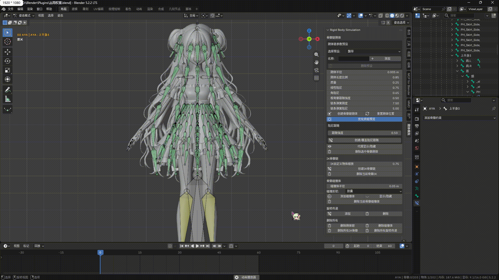

## Features

- Generate rigid-body proxies and spring joints for selected bone chains, including multiple chains at once.
- Add bone colliders so simulated chains can interact with the body, arms, legs, and other parts.
- Create IK from a continuous chain or bind a separate IK control bone to a solver chain in two-island mode.
- Reset physics proxies, create damped-follow constraints, toggle proxy visibility, and clean up generated content.
- Toggle limit-surface preview on armature-bound subdivision meshes and transfer local X-axis rotation for fingers and helper chains.

## Versions and installation

| Package | Minimum Blender version | Intended for |
| --- | --- | --- |
| `4.2` build | Blender 4.2 | Blender 4.2 and newer 4.x releases |
| `5.2` build | Blender 5.2 | Blender 5.2 and newer releases |

Both builds provide the same feature modules; their main difference is the Blender API compatibility target. Install only the build matching your Blender version. Do not mix files from the 4.2 and 5.2 builds.

1. Download the package for your Blender version from GitHub Releases.
2. Use the package marked **4.2** with Blender 4.2, or the **5.2** package with Blender 5.2.
3. Install a Blender 4.x extension from **Edit > Preferences > Extensions > Install from Disk**. Install a legacy add-on package from **Edit > Preferences > Add-ons > Install...**.
4. Enable the add-on and select an Armature. Press `N` in the 3D View and open the **Rigid Body Simulation** sidebar tab.

Creation tools for chains, colliders, IK, and rotation transfer require **Pose Mode**. The panel is also visible in Object and Edit modes for settings and management.

## 1. Rigid-body bone chains

Rigid-body chains are useful for hair, ribbons, skirts, and clothing that should follow character animation while retaining dynamic motion. The add-on creates a rigid-body proxy and physics joints for the selected bones; the root remains animation-driven.

### Create a single chain

1. In Pose Mode, select a continuous parent-child chain.
2. Make the root the active bone. The root itself does not receive a dynamic body.
3. Choose a preset or adjust body radius, length scale, mass, damping, root-follow strength, and spring settings.
4. Click **Create Rigid-Body Chain** and play the timeline to inspect the simulation.

The images show selecting one chain, creating its proxies, and the resulting simulation.

| Select a chain | Create a rigid-body chain |
| --- | --- |
| 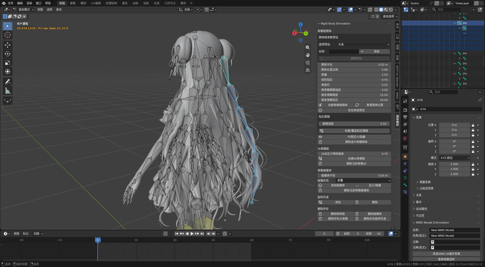 | 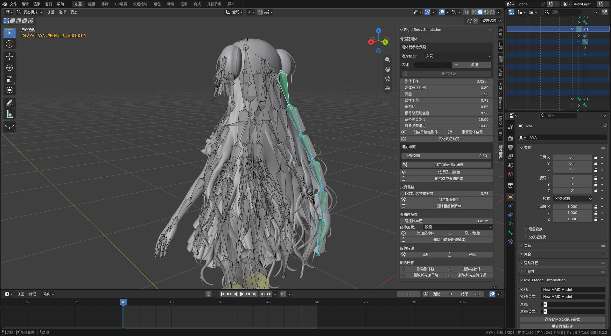 |

### Multiple chains and batch skirt setup

The original workflow using an active root and one continuous chain is preserved. The add-on can also identify multiple chains from the current selection:

- Select the roots of multiple chains to build them in one operation.
- When selected bones belong to separate chain islands, the add-on finds each chain root and builds the chains independently.
- For segmented skirt rigs, select all chain roots and create proxies and joints for each chain in one operation.

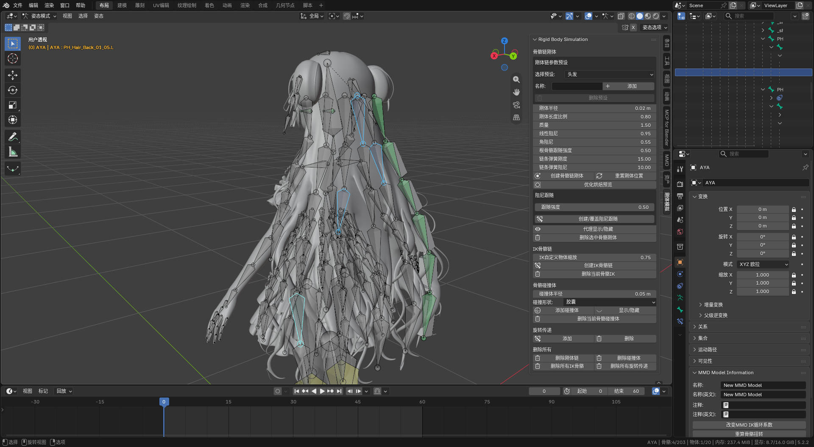

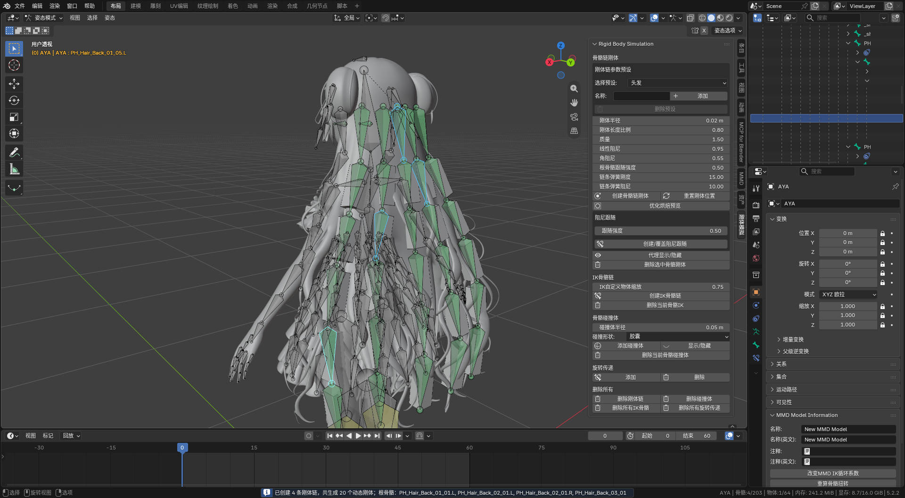

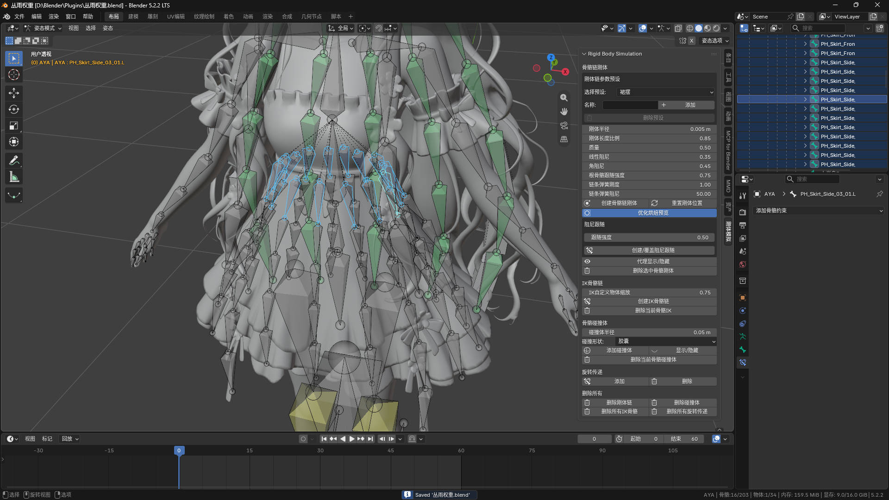

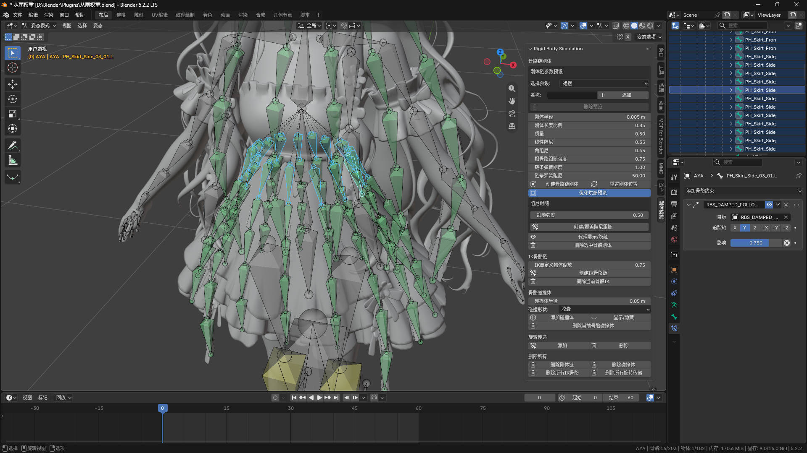

### Presets and parameters

The panel provides four built-in presets: **Default, Skirt, Hair, and Ribbon**. Values can be adjusted after choosing a preset. Enter a name and click **Add** to save the current settings to the scene. Select a user preset to delete it; leaving the name field empty saves changes to the current preset.

#### Hair

The Hair preset starts with a larger proxy radius and mass for longer strands. Increase damping gradually if the strand keeps oscillating or jitters during fast motion.

#### Ribbon

The Ribbon preset uses a smaller radius and mass with softer springs for narrow, elongated structures. Increase spring damping or reduce mass if it rebounds too much.

#### Skirt

The Skirt preset offers moderate mass and stable root following, making it suitable for batch creation across multiple skirt chains. Tune proxy radius and length scale for the number of layers and spacing between chains.

| Preset | Radius | Length scale | Mass | Linear damping | Angular damping | Root follow | Spring stiffness | Spring damping |
| --- | ---: | ---: | ---: | ---: | ---: | ---: | ---: | ---: |
| Default | 0.01 | 0.85 | 0.50 | 0.85 | 0.45 | 0.50 | 10 | 7.5 |
| Skirt | 0.01 | 0.85 | 0.50 | 0.85 | 0.45 | 0.50 | 10 | 7.5 |
| Hair | 0.02 | 0.80 | 1.50 | 0.95 | 0.55 | 0.50 | 15 | 10 |
| Ribbon | 0.005 | 0.85 | 0.25 | 0.75 | 0.65 | 0.50 | 7.5 | 5 |

Radius and length scale set proxy coverage; mass controls inertia; linear and angular damping suppress motion. Root-follow strength and spring settings affect how the chain follows, rebounds, and settles. Spring stiffness and damping use a `1–100` panel scale and are converted to internal values when joints are created.

### Follow, reset, and baked preview

- **Damped Follow** creates or overrides a follow constraint for each selected bone. Its target proxy is found from the first child bone; bones without a matching child proxy are skipped.
- **Reset Body Positions** moves all generated rigid-body proxies for the active armature back to their corresponding bone centers while preserving chain joints and root-follow relationships.
- **Optimize Baked Preview** toggles the subdivision modifiers' **Use Limit Surface** option on meshes bound to the armature. It helps compare baked simulation previews; it does not clear or rebake the rigid-body cache.
- **Rotate bones during playback** to move upstream bones; the chain is updated from its anchor and continues simulating.

If an old cache leaves a proxy at an outdated position, inspect the rigid-body world cache and clear or rebake it. Use **Reset Body Positions** afterward if the proxies need realignment.

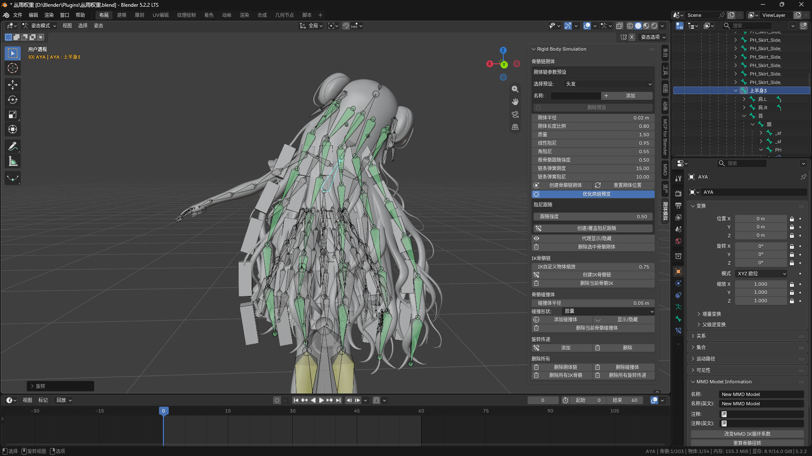

| Reset body positions | Follow root motion after reset |
| --- | --- |
| 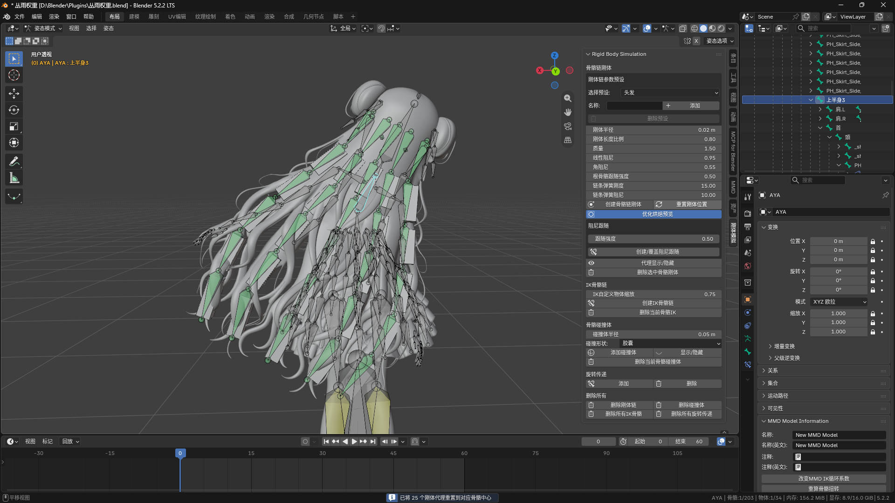 | 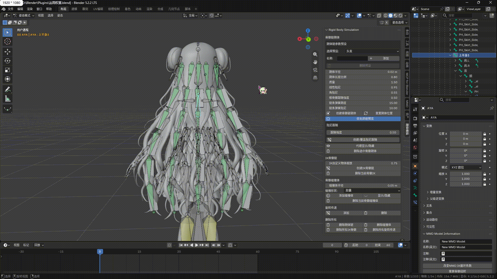 |

| Rotate a bone during simulation | Damped follow auto-target |
| --- | --- |
| 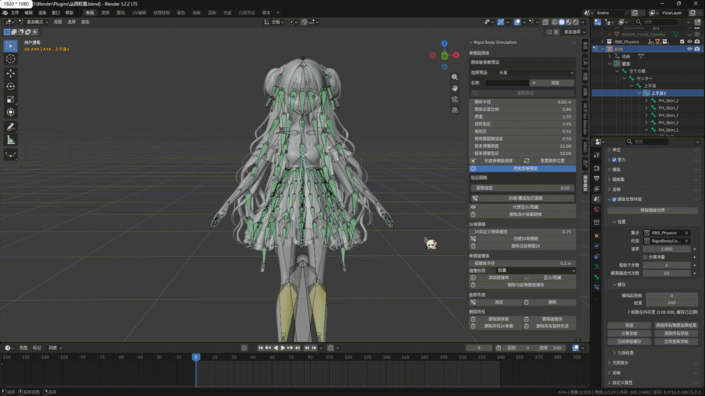 | 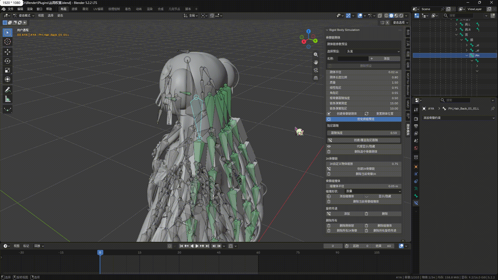 |

| Unoptimized baked preview | Optimized baked preview |
| --- | --- |
| 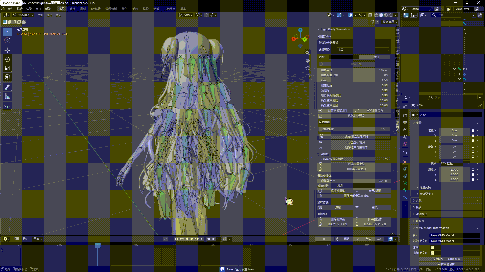 | 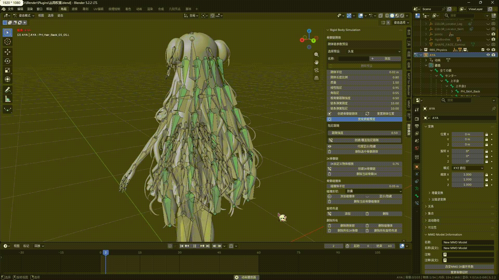 |

The rigid-body world's **Steps Per Frame** and **Solver Iterations** affect collision precision and performance. Higher values can improve stability for fast-moving bodies or small colliders, but increase simulation cost. Start low and increase them gradually.

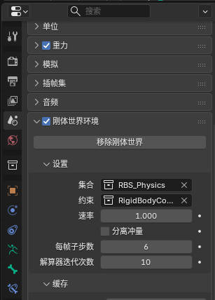

## 2. Bone colliders

Bone colliders are passive obstacles driven by bones. Use them on the torso, arms, legs, or other body parts to interact with simulated hair and clothing. Select one or more bones, set the radius, choose **Box**, **Capsule**, or **Sphere**, and click **Add Colliders**. Adding a collider again for the same bone replaces that add-on collider.

| Add bone colliders | Collision result |
| --- | --- |
| 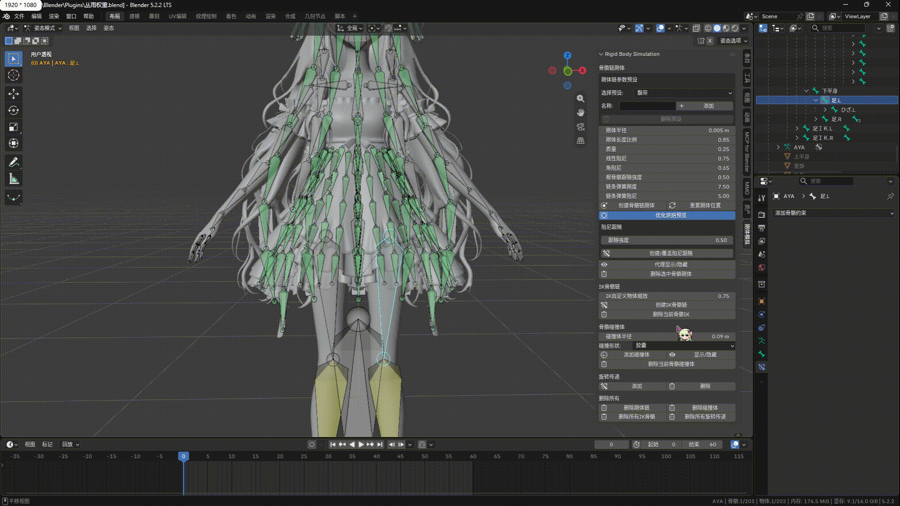 | 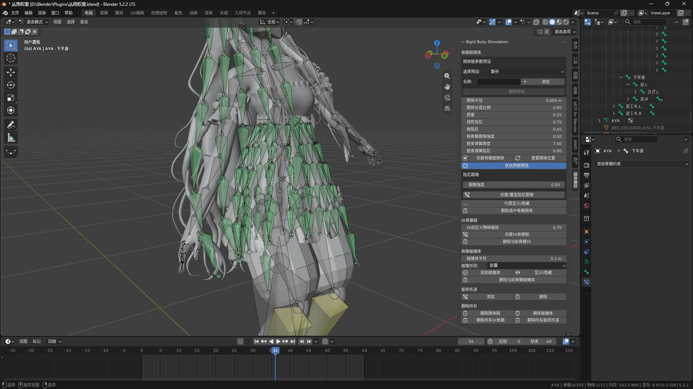 |

**Show/Hide** changes viewport and render visibility only. Hidden colliders remain active in physics. Use **Delete Selected Bone Colliders** to remove colliders from selected bones, or use the delete-all controls to remove all generated colliders on the armature.

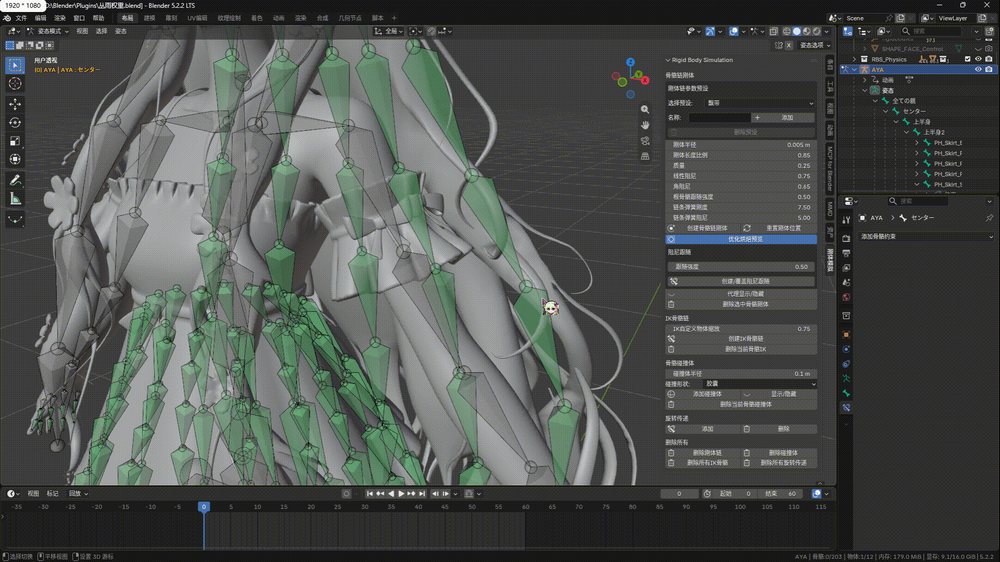

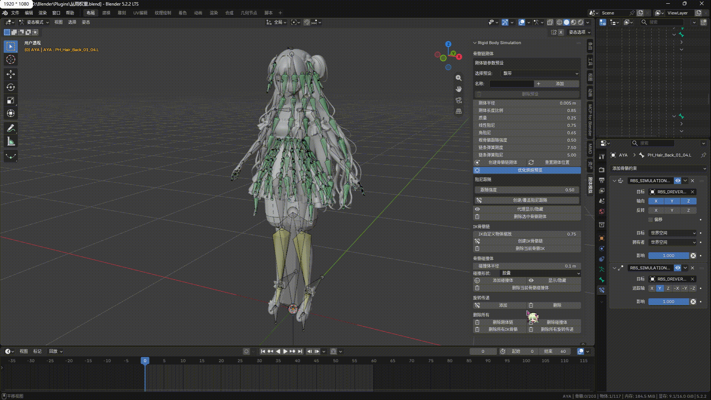

## 3. IK binding

The add-on creates Blender-native IK constraints and a movable custom control shape. **IK Custom Object Scale** applies one value uniformly to the X, Y, and Z axes.

### Continuous-chain mode

Select a continuous IK chain and make its end bone active, then click **Create IK Bone Chain**. The add-on creates an IK control bone and control shape, then adds an IK constraint to the solver chain.

### Two-island mode

To bind an existing, separate IK control bone:

1. Select the existing IK control bone and make it active. This island must contain exactly one bone.
2. Also select the separate, continuous, unbranched chain to solve.
3. Click **Create IK Bone Chain**.

The active bone is reused as the IK target, so no additional control bone is created. The terminal bone of the other island receives the IK constraint, and the chain length is based on the selected solver bones. Selections with more than two islands, multiple bones in the control island, or a branched solver chain are rejected.

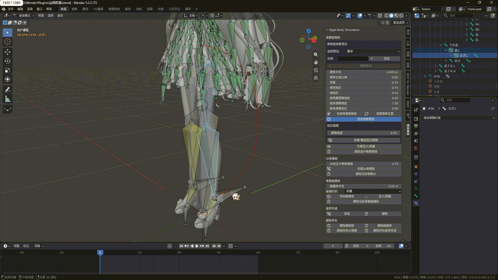

Use **Delete Selected Bone IK** from a related control or IK bone to remove its generated binding. **Delete All IK Bones** removes the add-on's IK content from the armature.

## 4. Rotation transfer

Rotation transfer is useful for fingers and helper bones that should inherit a parent's local X-axis rotation. Select a continuous chain, make the source bone active, and click **Add**. The add-on adds local-space `Copy Rotation` constraints to following bones, using only the X axis. Repeating the operation replaces only the add-on's transfer constraints and leaves other custom constraints intact.

**Delete** removes rotation-transfer constraints from selected bones. **Delete All Rotation Transfer** clears the add-on's rotation-transfer constraints from the armature.

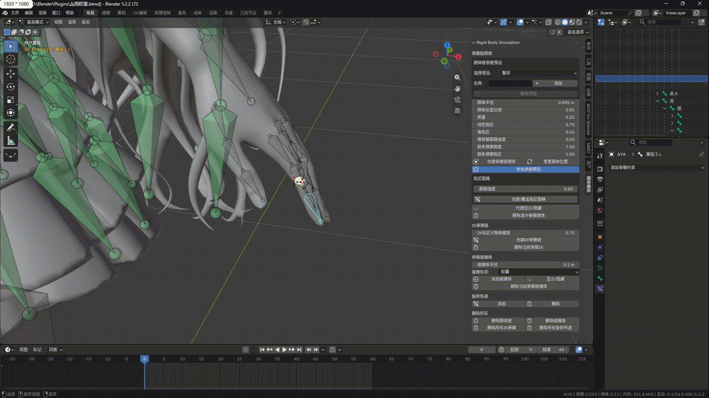

## Visibility, deletion, and tips

- **Show/Hide Proxies** changes visibility for rigid-body proxies on the active armature only; physics continues running. Collider visibility behaves the same way.
- **Delete Selected Bone Bodies** removes generated proxies and joints associated with selected bones. The delete-all controls clear rigid-body chains, colliders, IK, or rotation transfer by module.
- Cleanup controls remove generated content from the selected module independently, keeping unrelated module content separate.
- Keep chain selections unambiguous. Single-chain mode expects a continuous parent-child chain; multi-chain mode identifies chains from their selected roots or child bones.
- If chains penetrate or jitter, check collider radius, proxy length, mass, and damping. Thin structures may need a smaller radius and adjusted spring settings.
- If proxies are displaced or the cache is stale, inspect the cache first; clear or rebake it, then reset proxy positions as needed.
- Results depend on armature hierarchy, scene scale, rigid-body world settings, and cache state. Test settings on a short chain before applying them to a complete character.

This add-on uses Blender's built-in rigid-body system and is licensed under **GPL-3.0-or-later**.
